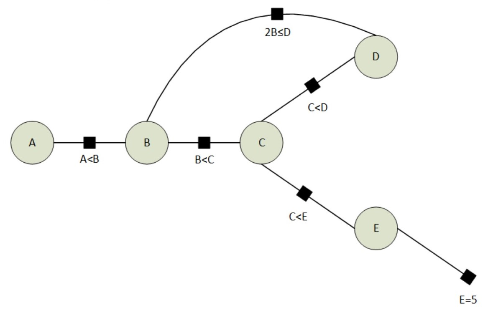

# Gedächtnisprotokoll GDKI WS18/19

_vorläufige Version 15.03.2019_

## Verweise auf erstes Auftreten der Aufgaben

Alle Aufgaben bis auf die erste sind exakt gleich schon in älteren Klausuren aufgetreten, der Vollständigkeit halber sind sie unten trotzdem nochmal aufgeführt.

| Hier | Klausur |     |
| ---- | ------- | --- |
| A1   | neu     |     |
| A2   | WS16/17 | A3  |
| A3   | WS14/15 | A2  |
| A4   | WS14/15 | A3  |
| A5   | SS16    | A2  |
| A6   | SS16    | A6  |

## Aufgabe 1: Diverses

1. Please state Bayes Theorem for two random variables `X,Y`.
2. Given 3 random variables `X,Y,Z`, how is `P(X|Y)` defined in termes of `P(X,Y,Z)`?
3. Which properties does a heuristic have to fulfill to be admissible?

## Aufgabe 2: Constraints = WS16/17-A3

Domain for `A, B, C, D, E: {1, 2, 3, 4, 5}`

! Please note „≤“ at 𝐵 ≤ 𝐷

E is set as `5`

a) Wende bis zur Konvergenz Constraint Propagation an und gib für A, B, C, D die übrig gebliebenen Domains an

b) Wie viele verschiedene Lösungen/ Belegungsmöglichkeiten gibt es?

## Aufgabe 3: CSP, Backtracking = WS14/15-A2

Backtracking is a basic method to solve a CSP. We discussed three heuristics to speed up backtracking.

1. Choice of variable: Assume variable X has more remaining values than variable Y. Which variable would you pick for the next assignment? Answer: [X/Y]
2. Choice of variable: Assume X and Y have equal remaining values, but X is involved in more constraints. Which is the variable for the next assignment? Answer: [X/Y]
3. Choice of value: Assume the value assignment X = 1 constraints the ’neighbours’ of X more than X = 2. Which value assignment would you pick next? Answer: [1/2]

## Aufgabe 4: Bandits = WS14/15-A3

Assume you have 3 bandits. You have already collected a few data form these bandits:

- From bandit 1: `2 5 1 4`
- From bandit 2: `1 5`
- From bandit 3: `1 3`

Provide the UCB scores for each of the three bandits. Replace the $ln$ by $log_2$ for simpler
calculation. Assume $\beta$ = 1. Write the solution in the box (expressions with $\sqrt{}$ are ok):

- UCB score for bandit 1:
- UCB score for bandit 2:
- UCB score for bandit 3:

## Aufgabe 5: Value-Iteration = SS16-A2

## Aufgabe 6: Message Passing = SS16-A6
