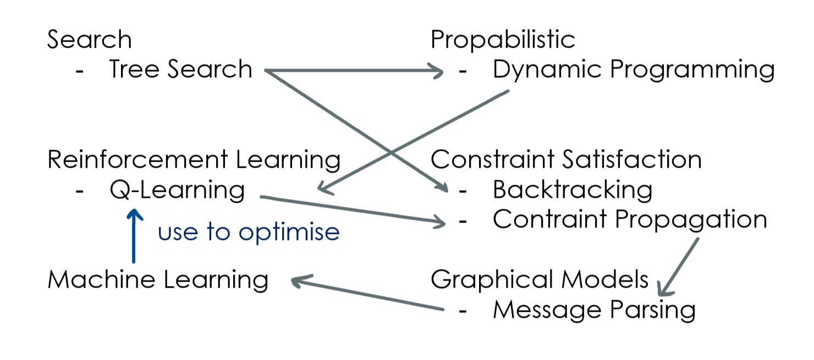

# Hinweise zur Vorbereitung auf die Klausur (MT040219)

## Mitschrieb zum Schaubild

### Search

- Wichtig ist hier die **Tree Search**
- Unser Entscheidungsprozess ist **deterministisch**, also "unfrei"
- Projiziert auf ein Spiel ist das Gegenüber/der Gegner nicht deterministisch, daher haben wir ihn durch
einen deterministischen Gegner ersetzt. Dieser Gegner war Min, als wir über MiniMax geredet haben (der böseste mögliche Gegner).

Im Zweiten Teil der Vorlesung haben wir das propabilistisch analysiert

### Propabilistic

- Wir haben genau das gleiche gemacht wie bei den Entscheidungsprozessen, nur im Propabilistischen.
- Die propabilistischen Formulierungen, die dabei rauskamen, waren (debug? #TODO: nachschauen!) Entscheidungen
- Markow Entsvcheidungsprozesse (MDPs)
- Eine bestimmte Entscheidung läuft beim deterministischen einen bestimmten Pfad den Baum herunter.
Den Baum haben wir in der Modellierung ersetzt durch den **Markow Entscheidungsprozess**, durch diesen propabilistischen Prozess.
- Das heißt bezüglich der Algorythmik, dass eine Baumsuche durch dynamisches Progammieren ersetzt wurde.

### Reinforcement Learning

- Hier betrachten wir die Umwelt nicht nur propabilistisch, wir kennen die Umwelt nicht einmal.
- Das heißt, der Agent kennt die Umwelt gar nicht, das heißt die einzige Chance, mit der Umwelt umzugehen, ist die Umwelt zu explorieren. - Das nennt sich **Reinforcement Learning**
- Methodisch passiert hierbei folgendes: Aus dynamischem Programmieren mit einem Modell der Welt (Sie nehmen eine Wertefunktion, die Ihnen die optimale Strategie beschreibt. Die Wertefuntion ist rekursiv aufgebaut und sie können zurückiterieren und so die optimale Entscheidung treffen) wird **Q-Learning** oder ältere Formen wie TD-Learning oder SARSA.
- Es ist wichtig zu verstehen, dass wenn ich ein Modell, das ich kenne, stochastisch mache indem ich es ersetze durch Daten, hierbei Q-Learning herauskommt.

*Der Agent, der eine Entscheidung treffen soll hat keine Ahnung von der Umwelt, er kann nur mit der Blackbox interagieren. Die Blackbox gibt nur einen Reward für die Aktion aus.*

*Es ist eine stochastische Variante von dynamischem Programmieren*

### Constraint Satisfaction Problem

- Auf den ersten Blick würde man denken es hat nichts mit den ersten beiden Punkten zu tun. Das CSP ist primär ein Problem über nur einzige Entscheidung, und zwar "eine Karte anzufertigen oder alle Variablen zu beziffern". 
- Das CSP ist im Grunde genommen nicht sequenziell sondern per Definition ein Problem wo man sagt: "Geben sie mir eine Lösung!" und die Lösung ist ein assignment zu allen Variablen, aber um eine Entscheidung zu finden ist der Standardansatz das Sequenzialisieren - **sequential assignment**.
- Das mag zwar nicht wichtig erscheinen aber es ist ein ziemlich konzeptioneller Punkt, denn anfangs ist es nicht klar, dass man das tun muss. Es gäbe auch andere Methodiken, die eher auf (parallelen) Optimierungs- oder Interferenzprozessen basieren, aber der Standardansatz ist, das Problem sequenziell zu zerlegen. Das bedeutet, dass man zum Beispiel Werte der Karte sequenziell zuweist. Hier ist die Lösung **Backtracking** und **Treesearch**.
- Methodisch macht man dann Constraint Propagation, was sehr eng mit dynamischem Programmieren verwandt ist, weil bei CP die Funktion, mit der wir jetzt die Variablen festlegen, die Indikatorfunktion ist, die aussagt welche Belegungen überhaupt noch erlaubt sind.
- Die Constraint Satisfaction nutzt die Constraints der benachbarten Variablen um die Belegungen aus dem Raum der möglichen Werte herauszustreichen, um herauszufinden welche Variablen für dieses Feld denn noch möglich sind. Diese Propagation ist sehr ähnlich zum dynamischen Programmieren.

### Graphical Models

- Message parsing, insbesondere auf Bäumen
- "Loopy"
- Es gibt auch andere Möglichkeiten, Wahrscheinlichkeiten zu schätzen, wenn der Graph nicht als Baum darstellbar ist
- Als Spezialfall: HMMs
- Wichtig ist: Man merkt, das (hinbug??) Modelle ein Spezialfall sind von graphischen Modellen ist
- Von der Problemstellung sind graphische Modelle nichts anderes als constraint satisfaction probleme, aber propabilistisch. Dementsprechend ist von der Methodik her Message Parsing nichts anderes als eine propabilistische Version von Constraint Propagation, wo bei CP wir Indikatiorfunktionen hatten, die zu jeder Domain sagen, ob ein Wert möglich ist oder nicht (Eine richtige binäre Funktion mit nur zwei möglichen Outputs), und das übersetze ich in Messages, in reelle Zahlen, die man aufmultipliziert um rauszufinden was denn wahrscheinlich vorliegt.

### Machine Learning

*war fast nicht in der Vorlesung

- Machine Learning als Spezialfall von graphischen Modellen betrachtet, also als propabilistische Interferenz

$$ P(f|D) = \frac {P(D|f) * P(f)}{P(D)} $$

- Machine Learning kann genutzt werden um bei Reinforcement Learning die value- oder Q-Funktion zu bestimmen oder ein $P(s'|s,a)$ oder $R(s|a)$ zu lernen
- Die Gleichungen in einem (2-layer) NN können in der Klausur abgefragt werden.

## Überblick

Type          | sequential Decisions   | Interference
------------- | ---------------------- | ------------  
deterministic | Search                 | (Constraint Propagation?)
propabilistic | Propabilistic          | Graphical Models
learning      | Reinforcement Learning | Machine Learning

## Hinweise zum Skript

- Generell ist das Inhaltsverzeichnis wichtig
- `**` bedeutet, dass etwas nicht Klausurrelevant ist

### Suche: Breitensuche/Tiefensuche/iter.Tiefensuche/A*

- Wissen, was die Algorythmen machen und in der Lage sein, sie im Kopf durchzugehen
- Die Komplexitäten der Algorythmen kennen
- Wissen, was eine **admissive heuristic** ist
- Bei gegebener Funktion angeben, ob es sich um eine admissive heuristic handelt

### Wahrscheinlichkeiten

- Standardpolynomsatz (?)
- Was ist eine Marginalwahrscheinlichkeit?
- Was ist eine Konditionalwahrscheinlichkeit?
- Beides auch mit 3 Variablen
- Bayessche Regeln verstehen
- "Verbundwahrscheinlichkeit"

### Bandits, MCTS & Games

- Upper Confidence Bounds
- Monte Carlo Tree Search

### Dynamisches Programmieren

- Markov Entscheidungsprozesse auf jeden Fall, mini kleines Problem wo man Value Iteration 3 mal durchführen muss
- Value und Q-Iteration muss man wissen

### Reinforcement Learning

- "Konzeptionell ist das Wichtigste überhaupt bei Reinforcement Learning, dass man die Grundlage von Reinforcement Learning versteht: Dass man Q-Learning ableiten kann durch eine stochastische Varianz und dynamisches Normieren, und das impliziert auch den Konvergenzbeweis von Q-Learning" --> kann aber in der Klausur nicht getestet werden.
- "Ein Agent läuft in der Welt rum, wie oft müsste er zufällig bis zum Ziel kommen bis er am Start eine Value != 0 hat (einfacher als in Übung)
- Epsilon-greedy Exploration sollte man wissen

### Constraint Satisfaction Problems

- Backtracking und die Heuristiken, die wir gelernt haben.
- "Sie sind in einer gegebenen Situation, die sie mit Backtracking/CSP lösen. Welche Variablen picken sie sich raus?" --> testet Variable Order (Min. Remaining Value etc.)
- Constraint Propagation: "Hier sind die Variablen, die sie kennen und die Constraints, die sie erfüllen, angenommen Sie führen jetzt Constraint Porpagation aus ohne Backtracking. Wohin konvergiert das? Was sind die verbleibenden Domains und Wertelängen?"

### Graphical Models

- "Hier ist ein kleines graphisches Modell, berechnen die die Posterior von x gegeben dieser Beobachtung." --> Message Parsing zum Beispiel
- Definition von "Unabhängig": "Gegebene Wahrscheinlichkeitstabelle. Frage: Sind die zwei Variablen unabhängig?"

### Neuronale Netze

- Die ganz grundliegende Definition hinter NNs.
- Ausrechnen einer partiellen Ableitung
